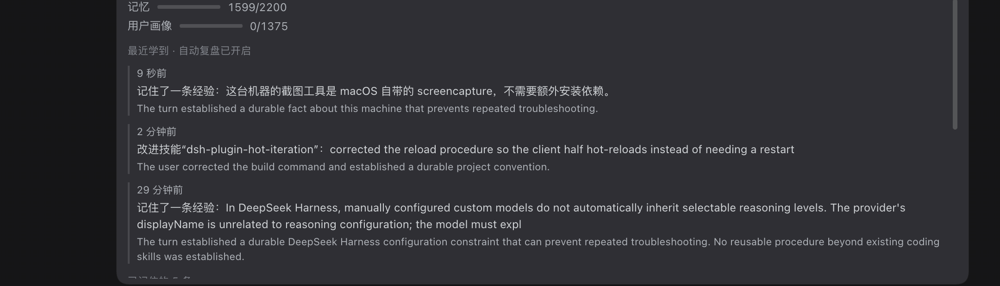
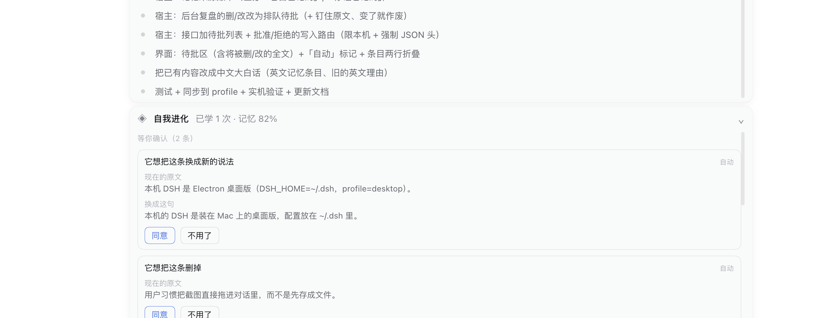

# dsh-self-evolution

[](LICENSE)
[](https://github.com/deepseek-ai/deepseek-harness)
[](#tests)

> An agent that forgets everything it worked out is expensive to work with. This plugin is the memory.

A self-evolution layer for **[DeepSeek Harness](https://github.com/deepseek-ai/deepseek-harness) (DSH)** — bounded long-term memory, an automatic review that runs after every turn, procedural memory that refines skills instead of piling them up, a health check for skills the loader would silently drop, cross-session recall, and a small card above the composer that says *what it just learned* only when there is something to say.

It is a port of the self-improvement loop from [Nous Research's Hermes Agent](https://github.com/NousResearch/hermes-agent) onto DSH's own primitives (`ctx.tools` + `ctx.systemPrompt`). **The DSH core is not patched.** The memory file format is byte-compatible with Hermes, so the two are interchangeable.


---

## Why this exists

Out of the box, DSH starts every session from zero. Whatever it worked out with you yesterday — the build command, the deploy quirk, the thing you corrected it on — is gone.

Hermes solves this with a background self-improvement review and two bounded memory files. DSH has the primitives to do the same but no implementation. This plugin is that implementation, plus the parts that make automatic learning **safe to leave switched on**:

- **It cannot lose what it learned by writing badly.** Every write is re-read and re-linted; a skill that would be dropped by the loader is rolled back, never reported as saved.
- **It cannot quietly rewrite your memory.** The unattended review can only *add*. Deleting or rewording asks first, shows you the exact text it would destroy, and pins that text so the approval can never land on a different entry.
- **It cannot become invisible furniture.** Everything below the fold is optional; the only thing it insists on is being readable at the moment it has news.

---

## Features

### 1. Bounded, self-managed memory

| | |
|---|---|
| **Store** | `<dshHome>/self-evolution/MEMORY.md` (agent notes) and `USER.md` (about you), entries separated by `§` — the same format as Hermes, so files are interchangeable |
| **Actions** | `add` / `replace` / `remove` / `list`; replace and remove locate an entry by a **unique substring** and refuse when the match is ambiguous |
| **Limits** | 2200 / 1375 characters by default (same as Hermes); **no automatic compaction** — when full, the tool returns `ok:false` *with every current entry*, so the model consolidates in the same turn and retries |
| **Deduplication** | An exact duplicate is rejected ("No duplicate added") |
| **Safety scan** | Before anything becomes durable: invisible Unicode (zero-width / bidirectional controls), instruction-override attempts, system-prompt exfiltration, private keys and cloud credentials, `authorized_keys` persistence, `curl … \| sh`. A hit is refused (`scanOnWrite: false` to disable) |
| **Injection** | A system-prompt section `self-evolution:memory` (order 100, `interpolate: false` — **memory text is never parsed as a `{{template}}`**), headed by `[67% — 1474/2200 chars]` |

### 2. `skill_learn` — the write side of procedural memory

Turns a workflow you just worked out into a `SKILL.md` under a skill root DSH actually scans (default `<projectRoot>/.dsh/skills` — inside the workspace, no approval and no restart needed).

The point of this tool is that **a skill it writes can always be loaded**:

- frontmatter values are emitted as JSON double-quoted scalars, which removes whole classes of "unquoted `description` containing `": "` → YAML parse failure → skill silently discarded" accidents;
- the file is **re-read and re-linted immediately after writing**, and rolled back (created → deleted, rewritten → restored) if it would not load — it never reports a skill it cannot prove is loadable;
- a `description` over 500 characters is rejected outright, because the catalog truncates silently past that point.

### 3. `skill_doctor` — the curator

DSH **silently discards** any skill whose frontmatter fails to parse, with no warning anywhere. `skill_doctor` scans every skill root DSH reads, reports which skills would be dropped and why, and keeps *load errors* (the skill disappears) separate from *quality warnings* (the skill loads but gets truncated):

- **load errors** — no frontmatter, missing `name`/`description`, non-kebab-case name, an unquoted value containing `": "` or ending in `:`, an unterminated quote, a duplicate key, a tab inside frontmatter;
- **quality warnings** — `description` over 500 characters.

With `fix: true` it repairs **surgically**: it rewrites only the offending line (adding quotes) and leaves every other byte — other frontmatter keys and the whole body — untouched, after backing the file up to `<file>.bak-<timestamp>`. It re-checks afterwards and gives up rather than claim a fix it cannot verify.

### 4. The automatic review — it learns after every turn

Everything above only happens if the model *remembers to do it*. This feature makes it automatic: when a turn ends, the plugin calls a **cheap auxiliary model** (no tools, JSON out) to decide whether the turn contained anything worth keeping, and writes it if so.

| | |
|---|---|
| **Trigger** | listens for the session's `turn/end` |
| **Skips** | turns that ended interrupted or in error **never learn**; turns with fewer than `reviewMinSteps` (2) tool steps are treated as trivial; only one review runs at a time |
| **Input** | the last `reviewMaxEvents` (40) events of the turn as compact text, capped at `reviewMaxChars` (6000); the text extraction follows the official one (reasoning blocks dropped, tool calls and results kept, errors marked) |
| **Output contract** | strict JSON — `{"memory":[{target,content}],"skill":{name,description,body}|null,"reason":"…"}`; the prompt asks explicitly for **restraint** (0–2 entries is normal, an empty result is a valid answer) |
| **Landing** | goes through **the same write path as the tools** — same scan, same limits, same dedupe, same read-back check — so the two can never drift apart |
| **Model** | defaults to whatever model the session is using; `reviewProvider`/`reviewModel` override it |
| **Failure** | **every failure is swallowed**: model down, timeout, garbage response, refused write — none of it can affect your session |
| **Skills** | **creates and refines**: a second pass merges new knowledge into an existing skill and compresses the result, instead of growing thirty near-duplicate skills |

### 5. Skills do not pile up

Hermes improves existing skills, which is why a month of similar tasks leaves one skill rather than thirty. Both paths exist here:

| Review verdict | Behaviour |
|---|---|
| `"action":"create"` | a genuinely new workflow → new skill |
| `"action":"improve"` | an existing skill already covers this → **a second model call** (that skill's current body plus the new knowledge) merges them into one deduplicated, compressed body, then replaces the file wholesale |

Four guardrails: the prompt carries the **existing skill catalog** (name + truncated description, 40 by default) so the model can recognise "this is the same kind of thing"; the file is **backed up** to `<file>.bak-<timestamp>` before every rewrite; a merged body over `skillMaxChars` (12000) is rejected and the old version kept, so skills cannot grow without bound; and the result is re-read and re-linted, rolling back if it would not load. `reviewSkillUpdates: false` turns rewriting off entirely and leaves creation only.

### 6. `session_search` — recall across sessions

Searches the **actual messages** of every past session. Memory is what the agent chose to keep; this searches everything that was ever said.

| Mode | What it does |
|---|---|
| `search` | full-text search across all sessions (matching excerpt + session id + seq); with `session_id`, only that session |
| `list` | recent sessions (id / creation time / working directory) |
| `read` | the raw events around one `seq` (`window`, default 2) for full context |

**Query behaviour (measured, and worth reading):** search **one distinctive term at a time**. Multiple terms are matched as an exact phrase, so every extra word narrows the result sharply. Chinese is tokenised by word: a whole word separated by spaces or punctuation matches, but a fragment inside a longer unbroken run does not. Hermes solves this with a purpose-built CJK tokeniser; DSH does not have one — when you need substring-level precision, scan the files with `grep` instead.

The tool registers **optionally**: if no search backend is wired up, every other part of the plugin keeps working. Enabling it means overriding DSH's own row in your profile patch:

```yaml
- id: session-query-sqlite
  name: '@deepseek-ai/dsh-session-query-sqlite'
  config:
    path: '/Users/<you>/.dsh/storages/session-search.db'
    openAt: first-search      # startup | first-search | never
```

The index is a **separate derived database** (it validates its own application id and never touches session persistence) and can be deleted and rebuilt safely.

### 7. A learning-loop nudge in the system prompt

A short, **stable** paragraph (`guidance: true`, on by default) tells the model when to write memory after a complex task, when to distil a skill, to check capacity before writing, and that a correction from the user outranks everything else.

---

## The card above the composer

**At rest it takes no space.** With nothing to report there is a single very faint `◈` in the composer's stats row:

```
⟳ 5 turns 247 steps · 271 tok/s   62.8M tok · cache 95%   ◈   39%
```

**When there is news it appears by itself.** A new learning, or a change waiting for your decision, puts one line above the composer:

```
◈  Self-evolution   Just learned: saved a note — this machine builds with pnpm build    ⌃
```

- The `◈` takes the theme accent colour and the line brightens: a sentence where you are already looking, not an unlabelled icon in a corner.
- **It is a persistent line, not a flash.** Hermes' own client source carries the note that this "must not be a transient toast that can be missed"; the line stays until you read it.
- Clicking it opens the panel, which counts as reading it. It then withdraws and the faint `◈` comes back.
- The panel holds: changes waiting for your approval, MEMORY / USER usage bars, the **recent learnings** timeline (when, what, and the model's stated reason), and the entries currently remembered.

| Quiet | Just learned | Expanded |
|---|---|---|
|  |  |  |

Two things **hold** the card open: a change waiting for your approval (it is asking permission — reading it once is not consent), and you having the panel open.

Motion is deliberately small: the card rises 6px, the panel unfolds downward, rows cascade in behind it, the two usage bars grow one after the other, the `◈` pulses once when something new arrives, and the chevron rotates on open. Everything is 200–460ms, nothing keeps a transform after it finishes, and `prefers-reduced-motion` cancels all of it.

### It will not edit your memory behind your back

Three ideas ported from Hermes, all of them about making automatic learning **safe to leave on**:

| Design | The problem it solves | What you see |
|---|---|---|
| **Provenance tags** | You cannot tell "it decided to remember this" from "I told it to remember this" — the loudest complaint in the Hermes community is an agent turning an offhand config tweak into a permanent preference | Entries written by the unattended review carry a small `auto` tag; entries you asked for do not |
| **Unattended review can only add** | A deletion or rewrite made while you are away is something you would never notice | It queues a proposed delete or reword instead of performing it; nothing moves until you say yes |
| **Approval shows what you would lose** | An "Agree" button with no context is not a decision | Each queued change shows the **full current text** it would destroy, and the proposed replacement; what you see is exactly what it will touch |



Two further belts: the queued change **pins the original text** when it is created, so if that entry has changed by the time you approve, the change is voided rather than applied to the wrong entry; and the write endpoint accepts only **loopback requests declaring JSON** (another page cannot produce that request — the browser's preflight blocks it — and non-local addresses get a 403). That is the plugin's **only** write endpoint.

Set `approveReviewEdits: false` if you would rather it merged on its own.

---

## Install

```bash
dsh plugin --profile <your-profile> add dsh-self-evolution
```

Then add the bundle to your profile patch (`~/.dsh/profiles/<profile>/cordis.patch.yml`):

```yaml
- id: self-evolution
  name: 'dsh-self-evolution'
  config:
    memoryCharLimit: 2200
    userCharLimit: 1375
```

The host half (tools, prompt section, HTTP routes) loads on the next DSH start. The client half hot-reloads on its own — DSH polls client artifacts and reloads the plugin when they change, so edits to `client.js` appear in a running window with no restart and no page refresh. Changes to `index.js` need a restart.

To uninstall, remove the bundle name from the profile's `dsh.profile.bundles` and delete the package. **Your memory and skill files are not removed**; delete `<dshHome>/self-evolution/` yourself if you want them gone.

## Configuration

Override the bundle's row by id `self-evolution` in your profile `cordis.patch.yml`. **A patch replaces the whole config object rather than merging into it**, so list every key you want to keep.

```yaml
- id: self-evolution
  name: 'dsh-self-evolution'
  config:
    storeDir: ''                # '' → <dshHome>/self-evolution
    memoryCharLimit: 2200
    userCharLimit: 1375
    extraSkillDirs: []          # extra skill roots to scan (absolute paths)
    skillsDir: ''               # '' → <projectRoot>/.dsh/skills
    enableMemoryTool: true
    enableSkillTools: true
    guidance: true
    scanOnWrite: true
    # background review
    autoReview: true
    reviewMinSteps: 2           # turns with fewer tool steps than this are skipped
    reviewMaxTokens: 1200       # how much one review may write
    reviewMaxEvents: 40         # events of the turn the review sees
    reviewMaxChars: 6000        # character cap on those events
    reviewProvider: ''          # '' → whatever model the session is using
    reviewModel: ''
    reviewTimeoutMs: 90000
    learningLog: ''             # '' → <storeDir>/learnings.jsonl
    # interface
    uiMode: auto                # auto (default) | always | off
    notify: verbose             # verbose (default) | on | off
    approveReviewEdits: true    # deletes/rewrites need your yes (default); false = let it merge on its own
```


## Trust boundary

This plugin writes with `node:fs` from the **host process**, so its writes are **not** subject to the session file sandbox (the sandbox only constrains the tool layer). There are two default paths, both configurable:

- `<dshHome>/self-evolution/{MEMORY,USER}.md` — the memory itself
- `<projectRoot>/.dsh/skills/` — skills (inside the workspace, matching the sandbox policy)

Three bookkeeping files live alongside them and rebuild safely if deleted: `learnings.jsonl` (the learning timeline), `origins.json` (which entry came from where), `pending.json` (changes waiting for your approval).

Memory is **permanently injected into the system prompt**, which is why `scanOnWrite` is on by default; and the plugin's only write endpoint (approve / reject a queued change) accepts only loopback requests that declare JSON — see the trust layer above.


## Tests

The host half runs against a fake Cordis context through the real `apply()` — the registration surface, the memory tool's write path, the provenance ledger, the approval queue, the web endpoints, and the background review (driven by a fake `llm` stream and real `session/event` dispatches). 155 checks.

The client half is a browser module, so a mistake in it is invisible from the outside — the module still loads and the card still renders. `test/client.test.mjs` therefore evaluates the real `factory()` with a stub loader and then cross-checks the two halves against each other: every `dshse-*` class the components render has a stylesheet rule, every `animation:` name has its `@keyframes`, every `t('…')` key exists in both dictionaries, and `prefers-reduced-motion` cancels every animated class. This is not ceremony: a hand-written edit once dropped 18 stylesheet rules and a translation key while `node --check` stayed happy and the UI still looked fine.

```bash
npm test        # both halves
node test/host.test.mjs
node test/client.test.mjs
```

The tests need `@deepseek-ai/*` to resolve, which comes from an installed DSH:

```bash
ln -s "/Applications/DeepSeek Harness.app/Contents/Resources/app/dsh/node_modules" node_modules
```

## Known limits

- **Read-only history.** The card shows what was learned but cannot edit or delete a record. Hermes' `/journey` allows both; this does not yet.
- The expanded timeline shows at most 6 records, with a count for earlier ones.
- "Already read" is stored in browser localStorage (`dsh:self-evolution:seen`), so a different browser — or clearing storage — will re-announce the latest learning once.
- `session_search` uses SQLite's `unicode61` tokeniser: token matching, not arbitrary substrings (`AI` will not match `BRAID`). The Chinese boundary is described above.
- The search index is **single-process**; do not point it at the session persistence database.
- `skill_doctor`'s frontmatter check is a **targeted lint**, not a full YAML parser. It covers the classes known to break the loader, exempts the legal forms (multi-line plain scalars, block scalars, CRLF), and does not claim completeness.
- `skill_doctor` reports **loadability**; whether a skill reaches the model-visible catalog also depends on `disable-model-invocation` / `user-invocable`, which it does not distinguish.
- The `memory` tool and a `memory` *skill* can coexist in the same session without conflicting, but the model may confuse the two names.
- Memory is global (shared across sessions), matching Hermes' one-home-one-memory model. Point `storeDir` inside a workspace to isolate it per project.
- The plugin writes with `node:fs` from the host process, so **its writes are not subject to the session file sandbox** — see the trust boundary section.

## Credits

The design is a port of the self-improvement loop in [Hermes Agent](https://github.com/NousResearch/hermes-agent) by Nous Research — bounded memory files, the post-turn review, skill refinement rather than accumulation, and the insistence that a notification about learning must be a persistent line rather than a toast. The implementation, the DSH client card, the curator, and the trust layer around unattended edits are this project's.

## License

MIT
